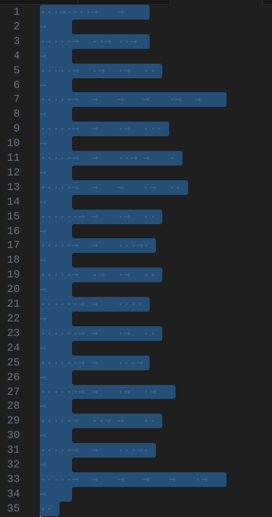
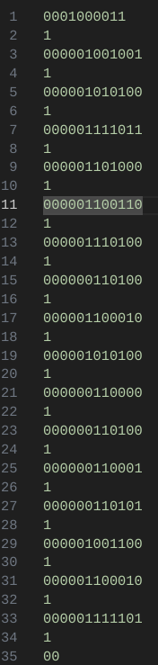

## Calculation

Find the flag.

Flag Format: CIT{example_flag}

(Side note: thank you to [kzrob](github.com/kzrob) for helping with this chall)

## Solution

Opening up the lua in a text editor, you can notice a lot of whitespace. Copy the whitespace and put it into an editor where you can see what the whitespace actually looks like, such as VSCode.



Replacing the arrows with `1` and dots with `0` give you this:

 
```bash
0001000011
1
000001001001
1
000001010100
1
000001111011
1
000001101000
1
000001100110
1
000001110100
1
000000110100
1
000001100010
1
000001010100
1
000000110000
1
000000110100
1
000000110001
1
000000110101
1
000001001100
1
000001100010
1
000001111101
1
00
```

Putting this into binary to decimal, you get:

`67 73 84 123 104 102 116 52 98 84 48 52 49 53 76 98 125 0`

You can put this in an ASCII to decimal converter to get the flag.


FLAG: `CIT{hft4bT0415Lb}`
