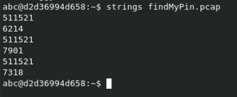

## pinpoint 1 (Forensics)
I use a plastic card and pin to log in for work. I seem to have forgotten it and the process to change it is a real hassle. Luckily I capture the USB interfaces on my computer for this very reason! Can you recover my pin from this capture? Wrap the pin in DawgCTF{}

## Solution
The first thing I did with the pcap file was run `strings` on it.

This shows 3 pin options, so I guessed all 3, and got the correct option.

FLAG: `DawgCTF{7901}`