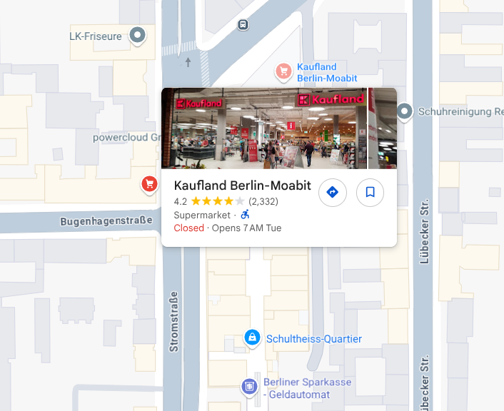

## Es ist alles in Butter

Mein Kumpel und ich sind während unseres Besuchs in Deutschland in einem Einkaufszentrum spazieren gegangen. Als wir dort waren, bekamen wir großen Hunger und beschlossen, in einen Supermarkt zu gehen, um frisches Brot und Döner zu kaufen. Als wir in den Laden kamen, waren wir angenehm überrascht, dass es dort eine Brotschneidemaschine gab! Das war sehr praktisch. Wir wollten zurückgehen, aber wir hatten vergessen, wo der Laden war! Dumme Amerikaner, nicht wahr? Wie auch immer, wir hatten Glück, denn mein Kumpel hat zufällig ein Foto in der Gegend gemacht, weil ihm die Architektur gefiel. Können Sie uns helfen, den Supermarkt zu finden, damit wir noch frisches Brot kaufen können, bevor wir zurückfliegen?

## Solution

We are given an image. Quick reverse image search says that the structure in the picture is `Schultheiss Quartier`. Going to Google Maps and searching for `supermarket near Schultheiss Quartier` gives many options, but only one fits the flag format of DawgCTF{wort_wort-wort}.

FLAG: `DawgCTF{Kaufland_Berlin-Moabit}`
