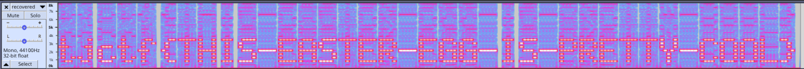

## album-cover
i heard theres a cool easter egg in the new tjcsc album cover

## Solution
Looking into enc.py, it is made clear that the script reads data an audio file, reshapes it, and then saves it as a grayscale image. This means that `albumcover.png` is the visual representation of the file flag.wav. 
The goal of this chall is to reverse the image back into flag.wav. This can be done using a [Python script](dec.py) that reverses the process.

Running the Python script reverses the image back into its orginal form of an audio file, and saves the recovered audio file as [recovered.wav](recovered.wav).

Listening to this audio file, it sounds like a bunch of robot noises. This makes me want to put the file into a spectrogram viewer like Audacity:

This reveals the flag.

Flag: `tjctf{THIS-EASTER-EGG-IS-PRETTY-COOL}`

