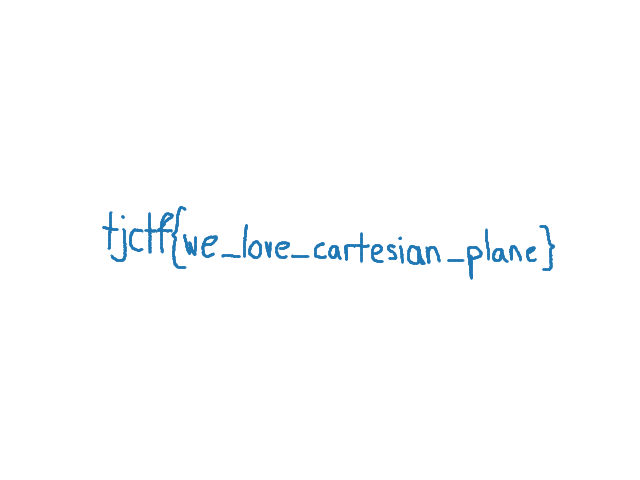

## mouse-trail
i was tracking my mouse movements while working on some secret documents. the data got corrupted and now i have thousands of coordinate pairs logged. can you help me figure out what i was drawing?

## Solution
Opening mouse_movements.txt, there are thousands of line containing what seems to be (x,y) coordinate pairs. This represents mouse movement overtime. A [Python script](visualize.py) can be made to visualize this data.

Running the script results in this visual:

Flag: `tjctf{we_love_cartesian_plane}`

